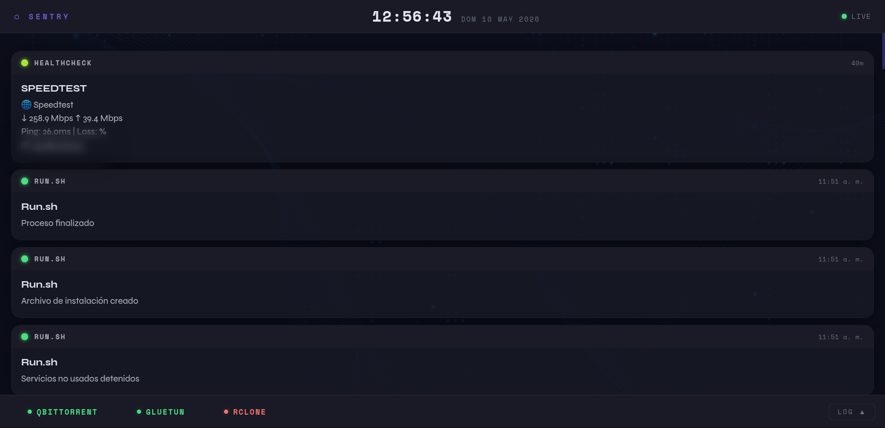

# Sentry

Dashboard de notificaciones en tiempo real para [Gotify](https://gotify.net/), con estética de pantalla de monitoreo.



## Características

- Notificaciones en tiempo real vía SSE (Server-Sent Events) — sin WebSocket en el browser, sin problemas de CSP
- Historial de los últimos 40 mensajes al cargar la página
- Notificaciones de prioridad 10 ancladas arriba con barra de cuenta regresiva configurable
- Color del indicador de prioridad (escala 1–10)
- Soporte para mensajes multilínea
- Log completo con timestamp, app y mensaje
- Barra inferior con estado de servicios (ping HTTP)
- Reloj en tiempo real
- Fondo personalizable con imagen
- Opacidad de notificaciones configurable
- Toda la configuración por `.env`
- Reconexión automática al stream de Gotify

## Stack

- **Backend**: FastAPI + uvicorn
- **Frontend**: HTML/CSS/JS vanilla
- **Relay**: Python conecta a Gotify por WebSocket y hace relay al browser por SSE
- **Docker**: imagen basada en `python:3.12-slim`

## Instalación

### Requisitos

- Docker y Docker Compose
- Una instancia de Gotify corriendo
- Un token de cliente de Gotify (Settings → Clients)

### Pasos

1. Clonar el repositorio:

```bash
git clone https://github.com/osdaeg/sentry.git
cd sentry
```

2. Copiar y editar el archivo de configuración:

```bash
cp .env.example .env
```

3. Editar `.env` con los valores correspondientes (ver sección de configuración).

4. Levantar el container:

```bash
docker compose up -d --build
```

5. Acceder en `http://tu-servidor:8700`

## Configuración

Todas las opciones se configuran en el archivo `.env`:

| Variable | Descripción | Ejemplo |
|---|---|---|
| `GOTIFY_URL` | URL base de Gotify | `http://192.168.1.10:8080` |
| `GOTIFY_TOKEN` | Token de cliente de Gotify | `AbCdEfGhIj` |
| `BACKGROUND_IMAGE` | URL o ruta a imagen de fondo (opcional) | `http://host/fondo.jpg` |
| `NOTIFICATION_OPACITY` | Opacidad del fondo de notificaciones (0.0–1.0) | `0.70` |
| `PRIORITY10_DURATION` | Segundos que una notificación de prioridad 10 queda anclada | `30` |
| `SERVICES` | Servicios a monitorear en la barra inferior | ver abajo |

### Configuración de servicios

El formato es `Nombre\|URL`, separados por coma:

```env
SERVICES=qBittorrent|http://192.168.1.10:8081,Gluetun|http://192.168.1.10:8888/v1/openvpn/status,rclone|http://192.168.1.10:5572
```

El ping es HTTP — un servicio se considera online si responde con código menor a 500. Se actualiza cada 30 segundos.

## Uso como dashboard permanente

Sentry está pensado para correr en una pantalla dedicada (tablet, monitor secundario). Algunas sugerencias:

- En Android: usar Firefox o un browser en modo kiosk, con "mantener pantalla encendida" activado
- Bajar el brillo al mínimo para reducir consumo
- Configurar una imagen de fondo oscura para mejor contraste

## Red Docker

El `docker-compose.yml` usa la red externa `GeneralNetwork`. Si tu red tiene otro nombre, editá el archivo antes de levantar:

```yaml
networks:
  TuRed:
    external: true
```

## Licencia

GPL V3
